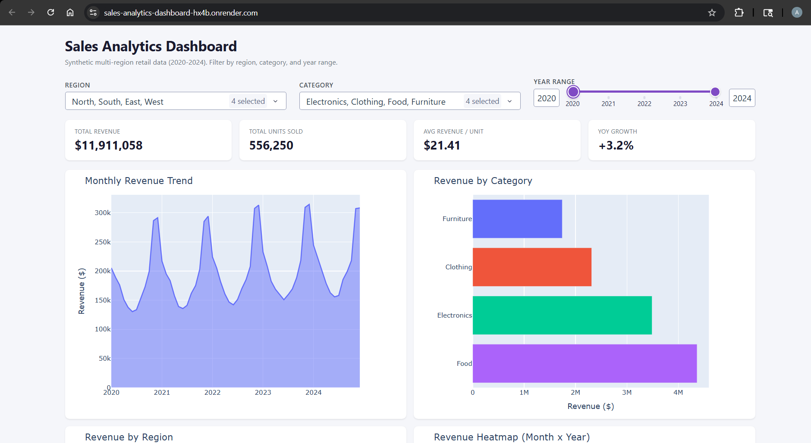

# Sales Analytics Dashboard

Interactive Dash web app for exploring multi-region, multi-category retail sales data.


---

## Live Demo

**[https://sales-analytics-dashboard-hx4b.onrender.com](https://sales-analytics-dashboard-hx4b.onrender.com)**

> Hosted on Render free tier — may take 30 to 60 seconds to wake up on first load.

---

## Preview



---

## Table of Contents

- [Overview](#overview)
- [Why I Made This](#why-i-made-this)
- [Features](#features)
- [Project Structure](#project-structure)
- [Data Generation](#data-generation)
- [Requirements](#requirements)
- [Quick Start](#quick-start)
- [How It Works](#how-it-works)
- [Deployment](#deployment)
- [What I Learned](#what-i-learned)

---

## Overview

This project is a fully interactive sales analytics dashboard built with [Plotly Dash](https://dash.plotly.com/). It uses synthetic but realistic retail data — 4 regions x 4 product categories x 60 months (2020-2024) — with real-world effects like proportional trend growth, seasonal cycles, holiday spikes, and category-specific pricing. All charts and KPI cards react live to filter changes via a single consolidated Dash callback.

---

## Why I Made This

I wanted to build something that went beyond a static notebook — a project where the output was an actual working web application someone could interact with. Dashboards are one of the most common deliverables in data roles, and I had never built one from scratch before. I chose to generate synthetic data instead of using a Kaggle dataset because I wanted to understand how realistic sales patterns are actually constructed — how trend, seasonality, noise, and event effects layer on top of each other mathematically. Figuring out why December had lower revenue than June in my first version, and then tracing it back to a phase error in the sin formula, taught me more about time-series data than any tutorial would have.

---

## Features

**Filters (3)**
- Region — multi-select dropdown (North, South, East, West)
- Category — multi-select dropdown (Electronics, Clothing, Food, Furniture)
- Year Range — range slider (2020-2024)

**KPI Cards (4, fully reactive)**
- Total Revenue — sum of filtered revenue
- Total Units Sold — sum of filtered units
- Avg Revenue / Unit — total revenue divided by total units
- YoY Growth — last year in range vs. previous year (%), with division-by-zero guard

**Charts (4)**

| Chart | Type | Description |
|---|---|---|
| Monthly Revenue Trend | Area chart | Revenue over time for the filtered selection |
| Revenue by Category | Horizontal bar | Side-by-side category revenue comparison |
| Revenue by Region | Donut pie | Regional share of total revenue |
| Revenue Heatmap | Heatmap (Month x Year) | Seasonal patterns across all years |

**Architecture**
- Single multi-output callback — all 5 outputs update from one function call, filtering the DataFrame exactly once per interaction
- Card-based responsive layout — CSS flexbox grid with no external UI framework

---

## Project Structure

```
Sales-Analytics-Dashboard/
│
├── app.py                  Dash app: data generation, layout, and callback logic
├── assets/
│   ├── style.css           Card-based responsive styling (auto-loaded by Dash)
│   └── preview.png         Dashboard screenshot for README
├── requirements.txt        Python dependencies
├── render.yaml             Render deployment config
├── .gitignore
└── README.md
```

Dash automatically serves everything inside the `assets/` folder — the CSS loads without any manual import in `app.py`.

---

## Data Generation

No external dataset is required. All 960 rows are generated programmatically inside `generate_sales_data()` using the following model:

```
Revenue = category_base x region_strength x seasonality x holiday_effect x noise + trend
```

| Component | Details |
|---|---|
| `category_base` | Per-category baseline (Food: $15k, Electronics: $12k, Clothing: $8k, Furniture: $6k) |
| `region_strength` | Multiplier per region (North: 1.2x, West: 1.1x, East: 1.0x, South: 0.9x) |
| `seasonality` | Sinusoidal cycle peaking in November/December — sin phase set to `month - 9` |
| `holiday_effect` | 1.35x multiplier applied in November and December |
| `noise` | Gaussian noise (sigma = 8%) for realistic row-level variance |
| `trend` | Proportional to `category_base x 0.04 x years_since_2020` — all categories grow at ~4%/year |
| `price_range` | Category-specific price per unit (Electronics: $40-80, Clothing: $20-50, Food: $5-20, Furniture: $60-150) |

Output: 960 rows (4 regions x 4 categories x 60 months), fully reproducible via `np.random.seed(42)`.

---

## Requirements

```
dash
plotly
pandas
numpy
gunicorn
```

```bash
pip install -r requirements.txt
```

---

## Quick Start

```bash
git clone https://github.com/abhinab44/Sales-Analytics-Dashboard.git
cd Sales-Analytics-Dashboard
pip install -r requirements.txt
python app.py
```

Open `http://127.0.0.1:8050` in your browser. No dataset download needed — data is generated on startup.

---

## How It Works

**Callback Architecture**

The entire dashboard is driven by a single `@app.callback` with 3 inputs and 5 outputs:

```python
@app.callback(
    [Output('kpi-cards', 'children'),
     Output('trend-line', 'figure'),
     Output('category-bar', 'figure'),
     Output('region-pie', 'figure'),
     Output('monthly-heatmap', 'figure')],
    [Input('region-filter', 'value'),
     Input('category-filter', 'value'),
     Input('year-slider', 'value')]
)
def update_dashboard(regions, categories, year_range):
    ...
```

The DataFrame is filtered exactly once per user interaction and all 5 components are recomputed and returned together — avoiding the redundant filtering that would happen with 5 separate callbacks.

**YoY Growth Calculation**

```python
last_yr = filtered[filtered['Year'] == year_range[1]]['Revenue'].sum()
prev_yr = filtered[filtered['Year'] == year_range[1] - 1]['Revenue'].sum()
yoy = ((last_yr - prev_yr) / prev_yr * 100) if prev_yr and prev_yr > 0 else 0
```

The guard `prev_yr and prev_yr > 0` prevents division-by-zero when the slider is set to a single year (the previous year falls outside the filter window and sums to zero).

---

## Deployment

Deployed on [Render](https://render.com) using `render.yaml` and `gunicorn`. The Flask server instance is exposed in `app.py` so gunicorn can find it:

```python
app = dash.Dash(__name__)
server = app.server
```

To deploy your own instance: fork this repo, go to Render, create a new Web Service, connect the repo, and Render auto-detects `render.yaml` and deploys automatically.

---

## What I Learned

- How to structure a multi-output Dash callback efficiently — filtering data once and distributing results to all components rather than using one callback per chart
- How sinusoidal seasonality works and why phase matters — shifting `month - 3` to `month - 9` moves the revenue peak from June to December, which is what retail data actually looks like
- Why additive vs proportional trend design matters — a flat `+$600/year` trend distorted percentage growth rates across categories with different revenue scales, making Furniture appear to grow 3x faster than Food purely as a math artifact
- How Dash's `assets/` folder handles automatic CSS injection without manual imports
- The edge cases in YoY percentage-change KPIs when the denominator can be zero, missing, or outside the current filter window
- How to expose a Dash app as a WSGI server for production deployment with gunicorn

---

## License

This project is open-source under the [MIT License](LICENSE).

---

*Built with Python 3.8+ · Plotly Dash · pandas · NumPy · Deployed on Render*
